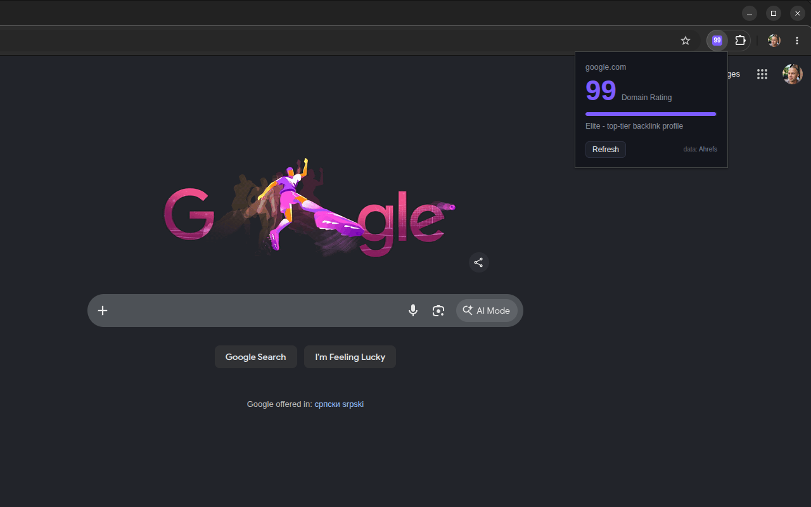

# DR Lens

A Chrome extension (Manifest V3) that shows the [Ahrefs](https://ahrefs.com) Domain
Rating of the site you're on, drawn right into the toolbar icon. Free, no API key.

[](https://chromewebstore.google.com/detail/REPLACE-WITH-LISTING-ID)

## Features

- DR of the current site rendered into the toolbar icon, color-coded by tier
  (purple 80+, green 60+, blue 40+, orange 20+, gray below).
- Popup with the exact score, a tier description, and a Refresh button.
- Per-tab icons: each tab shows the rating for its own site.
- Local cache (24 hours per domain) keeps API traffic minimal; only the visible
  tab triggers lookups.
- Local and private hosts (localhost on any port, IP addresses, `.local`,
  `.test`, `.internal`, intranet names) are never sent to the API.

## Install

Install DR Lens from the
[Chrome Web Store](https://chromewebstore.google.com/detail/REPLACE-WITH-LISTING-ID)
for one-click install and automatic updates. Requires Chrome 103 or newer.

Prefer to read the code you run? You can also install from source - see
[Development](#development).

## How it works

The background service worker listens for tab activation and navigation events.
For the active tab it extracts the hostname, checks a local cache in
`chrome.storage.local`, and only on a miss calls the free Ahrefs endpoint:

```
GET https://api.ahrefs.com/v3/public/domain-rating-free?target=<hostname>&output=json
```

The score is drawn onto a 16/32 px OffscreenCanvas and set as the tab's icon.

Cache behavior:

- Successful lookups are cached for 24 hours (DR changes slowly).
- API errors are cached for 10 minutes, network failures for 30 seconds.
- The popup's Refresh button bypasses the cache and any in-flight request.
- Expired entries are swept daily via `chrome.alarms`.

## Permissions

| Permission                    | Why it is needed                                                                  |
| ----------------------------- | --------------------------------------------------------------------------------- |
| `tabs`                        | Read the active tab's URL outside a user gesture, to know which domain to rate.   |
| `storage`                     | Cache ratings locally so the same domain isn't re-fetched for 24 hours.           |
| `alarms`                      | Daily cleanup of expired cache entries.                                            |
| `https://api.ahrefs.com/*`    | The only network host the extension talks to.                                      |

Note: `tabs` triggers Chrome's "Read your browsing history" install warning.
The extension reads URLs only to derive the hostname; nothing is logged or sent
anywhere except the hostname to the Ahrefs API. See [PRIVACY.md](PRIVACY.md).

## Development

No build step and no dependencies. Shared pure helpers live in `common.js` and
are imported by both the service worker and the popup (both run as ES modules).

### Install from source (load unpacked)

1. Clone this repository: `git clone https://github.com/kkomelin/dr-lens.git`
2. Open `chrome://extensions` in Chrome.
3. Enable "Developer mode" (top right).
4. Click "Load unpacked" and select the project folder.

Note: an unpacked copy is a separate extension from the store version
(different extension ID), so the two can run side by side and don't share
their caches.

### Tests

Run the unit tests (Node 20+):

```
npm test
```

### Package for the Chrome Web Store

```
npm run package
```

Validates the manifest, runs the tests, and builds
`dist/dr-lens-v<version>.zip` containing only the runtime files (manifest,
scripts, popup, icons), ready to upload to the
[developer console](https://chrome.google.com/webstore/devconsole). It also
prints a pre-publish checklist.

## License

[Apache-2.0](LICENSE). Domain Rating data is provided by Ahrefs under their
[Domain Rating license](https://ahrefs.com/legal/domain-rating-license).
